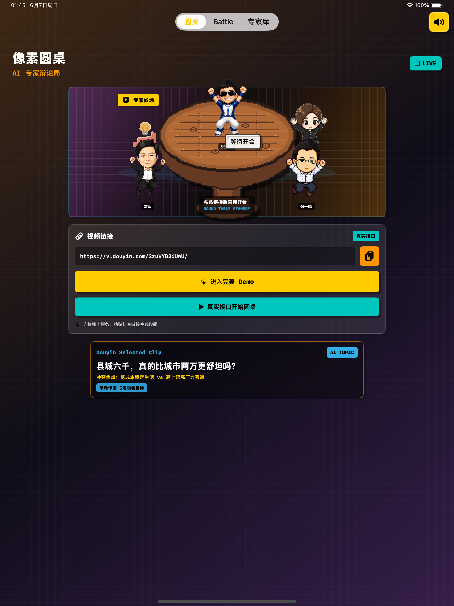
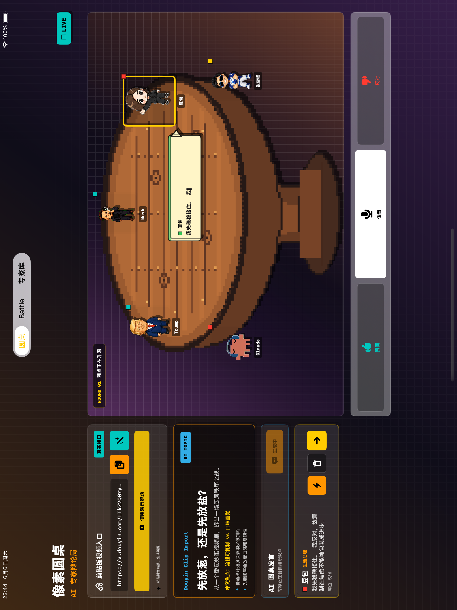
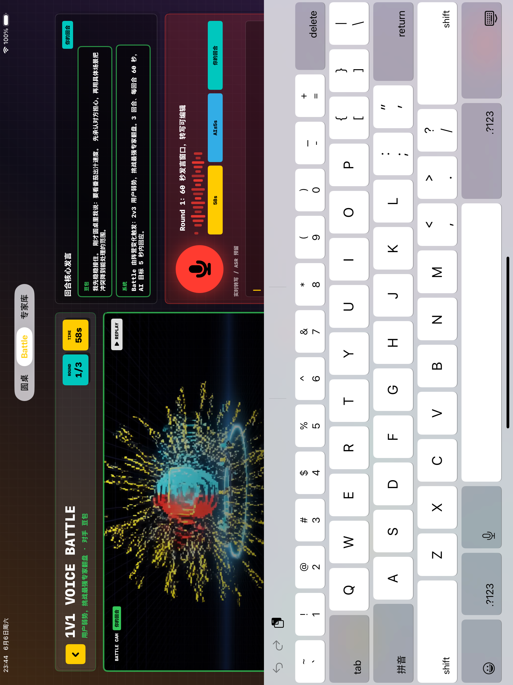
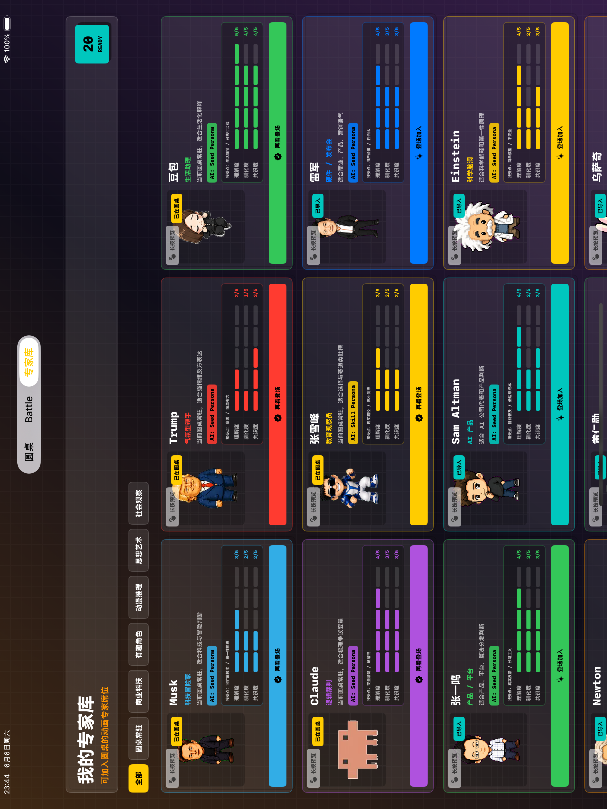

# 像素圆桌

像素圆桌是一款像素风 AI 观点辩论 iOS App。用户粘贴短视频链接后，App 会提炼争议议题，组织多位“专家角色”进入圆桌讨论；随后用户可以选择一位角色进入 Battle，通过语音或文字继续说服对方。App 内置角色素材、像素动画、配音、BGM、论坛回看视频、长图分享等完整移动端体验。

## 功能亮点

- **视频议题导入**：粘贴视频链接后，线上服务会生成辩题、争议点、核心论据和建议专家阵容。
- **AI 圆桌论坛**：多位专家按 Round 组织观点、反驳和收束，不只是轮流发言，而是会互相回应、质疑和博弈。
- **专家角色库**：内置多种商业科技、动漫推理、有趣角色等像素专家，支持加入圆桌、长按预览、登场配音和个性化展示。
- **Battle 说服模式**：用户可以开麦表达观点，系统转写后交给 AI 专家回应；专家会根据立场、历史对话和说服度持续反驳或松动。
- **论坛精彩回看**：圆桌结束后可播放内置高光视频，并支持下载和系统分享。
- **论坛长图分享**：圆桌结束后自动整理辩题、专家头像、对话气泡和观点精华，生成可保存到相册或分享的长图。
- **好友专家库**：支持通过二维码/文本载荷导入好友专家库配置，扩展角色选择。
- **声音与动效**：内置 BGM、按钮音效、专家短语音、像素角色动画和过渡视频。

## 截图

| 首页 | 圆桌论坛 |
| --- | --- |
|  |  |

| Battle | 专家库 |
| --- | --- |
|  |  |

## 项目结构

```text
.
├── ClipClashPixel.xcodeproj      # Xcode 工程
├── ClipClashPixel
│   ├── ClipClashPixelApp.swift   # App 入口
│   ├── ContentView.swift         # 主要界面、AI 调用、音频、圆桌和 Battle 逻辑
│   ├── Assets.xcassets           # App 图标、圆桌图、像素角色帧动画
│   ├── Resources                 # 专家 persona 配置
│   ├── VoiceClips                # BGM、音效、角色短语音
│   └── VideoClips                # 圆桌/Battle/论坛回看视频
├── Docs/Screenshots              # README 使用的产品截图
└── .github/workflows             # GitHub Actions 打包 unsigned IPA
```

## 线上服务端点

当前 App 默认连接线上服务器：

- 议题导入：`https://ios.classby.cn/clipclash/topic`
- 专家回复：`https://ios.classby.cn/clipclash/expert/reply`

工程也保留了覆盖能力：

- `UserDefaults` 中的 `ClipClashTopicEndpoint`
- `UserDefaults` 中的 `ExpertAIEndpoint`
- Info.plist 中的 `CLIPCLASH_TOPIC_ENDPOINT`
- Info.plist 中的 `EXPERT_AI_ENDPOINT`

这样可以在不改业务代码的情况下切换测试服务或生产服务。

## 本地编译

需要 macOS 和 Xcode。当前工程最低支持 iOS 17。

```bash
xcodebuild -list -project ClipClashPixel.xcodeproj
xcodebuild \
  -project ClipClashPixel.xcodeproj \
  -scheme ClipClashPixel \
  -destination 'generic/platform=iOS Simulator' \
  build
```

如需在真机或模拟器上运行，可以直接用 Xcode 打开 `ClipClashPixel.xcodeproj`，选择 `ClipClashPixel` scheme 后运行。

## GitHub Actions 打包 unsigned IPA

仓库内置 workflow：`.github/workflows/build-unsigned-ipa.yml`。

触发方式：

- push 到 `main`
- 在 GitHub Actions 页面手动运行 `Build unsigned IPA`

产物：

- Artifact 名称：`PixelRoundtable-unsigned-ipa`
- 文件名：`PixelRoundtable-unsigned.ipa`

这个 IPA 是未签名包，适合后续使用自己的证书或工具重新签名安装。常见方式包括：

- 使用 Apple Developer 个人/团队证书重新签名
- 使用 AltStore、Sideloadly 等工具按自己的 Apple ID 签名安装
- 使用企业或内部分发系统重新签名

## 权限说明

App 会使用以下 iOS 权限：

- 麦克风：用于 Battle 中录制用户发言
- 语音识别：用于把用户录音转写为文字
- 相机：用于扫描好友专家库二维码
- 相册写入：用于保存圆桌论坛长图

## 说明

本仓库包含 iOS App 所需的像素角色素材、音频素材、视频素材和 SwiftUI 代码。README 中展示的是产品能力与界面结构，实际 AI 回复质量取决于线上服务和模型可用性。
